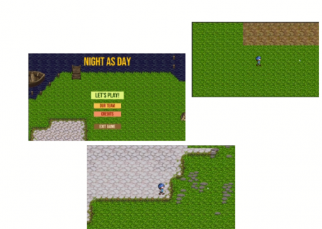
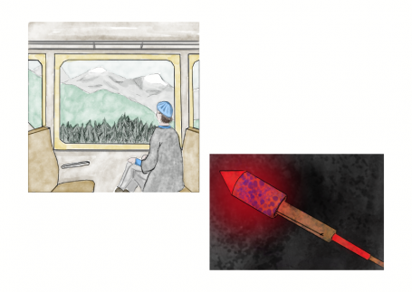
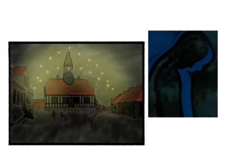

# Night as Day - Global Game Jam 2022 Submission (https://globalgamejam.org/2022/games/night-day-5)

RPG about Duan that visits the place from his childhood to find his memories from the past. Duan returned to his old village after more than 25 years. He didn't notice how much everything has changed in the last decades. He remembers that everything here used to be bursting with life. Especially the old marketplace with its town hall. But it still lies in ruins.

## Screenshots

## Our Team

We got to know each other during our study time at Harz University of Applied Science in Wernigerode, Germany.

**Justine Flohr** (student "media and game design"): Concept, Story, Writing and Art (story visualizaion, character animation)

**Dominik Viererbe** (student "computer science"): Concept, Programming, level design & gameplay

**Sabine M. Heyne** (graduate "media and game design"): Gameplay, UI, implementation in Unity, Art (Story visualization, character & map design)

**Viola Hößl** (student "media and game design"): Concept, Art (character animation)

## Credits

How to read this: filename | author/ contributor | License | description | link

### Fonts

- "Bebas Neue Regular" | Ryoichi Tsunekawa | SIL Open Font License, Version 1.1. | https://fonts.google.com/specimen/Bebas+Neue#about

### Visuals

- "tileset.png" | Buch | CC0 Background tiles https://opengameart.org/content/happyland-tileset
- "PathAndObjects.png" |  Zabin, Daneeklu, Jetrel, Hyptosis, Redshrike, Bertram CC-BY-SA 3.0 BG tiles + things market square https://opengameart.org/content/rpg-tiles-cobble-stone-paths-town-objects
- "TEMPLATE.png" | Cabbit | CC0 | Base for character | https://opengameart.org/content/24x32-bases
- "pixel_nature.png" | Deeppixel | CC0 | Trees | https://opengameart.org/content/mountain-hause-and-trees
    - "Tiles_nature.png" | SMHeyne | CC0 | Tree trunks + gravel path
        Based on pixel_nature.png by Deeppixel
- "signpost-outsidestuff.png" | Reemax | CC-BY-SA 3.0 / GPL 3.0 | Signposts | https://opengameart.org/node/31884
    - Attribution to Nemisys, Daniel Eddeland (Link) and Tuomo Untinen
- "lpc_grave_markers_rework-1.3.zip" | AntumDeluge | CC-BY-SA 3.0 / GPL 3.0 | Graves | https://opengameart.org/content/lpc-grave-markers-rework
    - All informations in "README.txt" in folder
    - Created by Barbara Rivera, Casper Nilsson, Carlo Enrico Victoria, Tuomo Untinen, ak-blanc, Johann C, & Jordan Irwin (AntumDeluge)
- "rocks.zip" | bluecarrot16 | CC-BY-SA 4.0 / CC-BY-SA 3.0 | Stones | https://opengameart.org/content/lpc-rocks
    - All informations in "CREDITS-rocks.txt" in folder
    - [LPC] Rocks by bluecarrot16, Johann Charlot, Yar, Hyptosis, Evert, Lanea Zimmerman (Sharm), Guillaume Lecollinet, Richard Kettering (Jetrel), Zachariah Husiar (Zabin), Jetrel, Hyptosis, Redshrike, Rayane Félix (RayaneFLX), Michele Bucelli (Buch) <https://opengameart.org/users/buch>

- "nails.png" | BizmasterStudios | CC-BY 4.0 | materials for UI | https://opengameart.org/content/rpg-crafting-material-icons

- "IconsPJ.png" | BizmasterStudios | CC-BY 4.0 | pickaxe, showel and axe | https://opengameart.org/content/tool-icons

## License

Night as Day 
Copyright (C) 2019-2022 Dominik Viererbe, Sabine Heyne, Justine Flohr, Viola Hößl

This program is free software: you can redistribute it and/or modify it under the terms of the GNU Affero General Public License as published by the Free Software Foundation, either version 3 of the License, or *(at your option)* any later version.

This program is distributed in the hope that it will be useful, but WITHOUT ANY WARRANTY; without even the implied warranty of MERCHANTABILITY or FITNESS FOR A PARTICULAR PURPOSE. See the GNU Affero General Public License for more details.

You should have received a copy of the GNU Affero General Public License along with this program. If not, see <<https://www.gnu.org/licenses/>>.